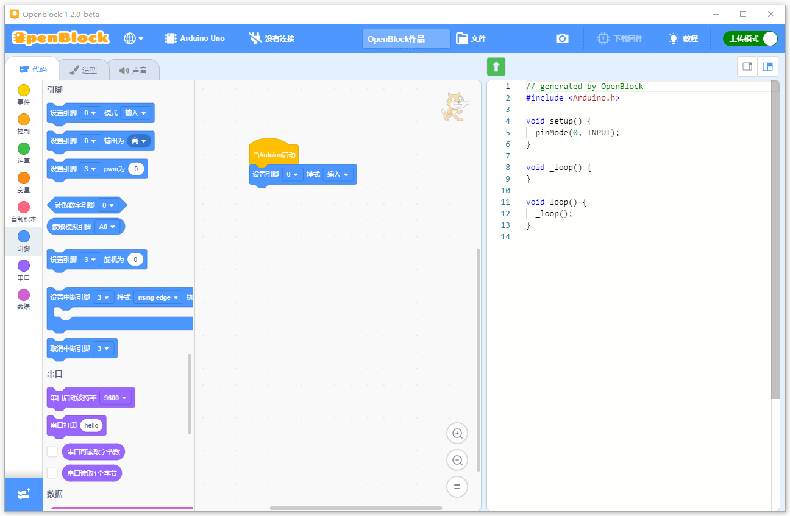

# openblock-desktop

OpenBlock as a standalone desktop application.

- **Support device**

	Arduino Uno, Arduino Nano, Arduino Mini, Arduino Leonardo, Arduino Mega2560

	Microbit

- **Support program mode**

	Realtime(Traditional scratch 3.0 mode), Upload

- **Unique feature**

	Support load external extensions

## Developer Instructions

Visit the wiki to lean more: [https://openblockcc.gitee.io/wiki/](https://openblockcc.gitee.io/wiki/)
